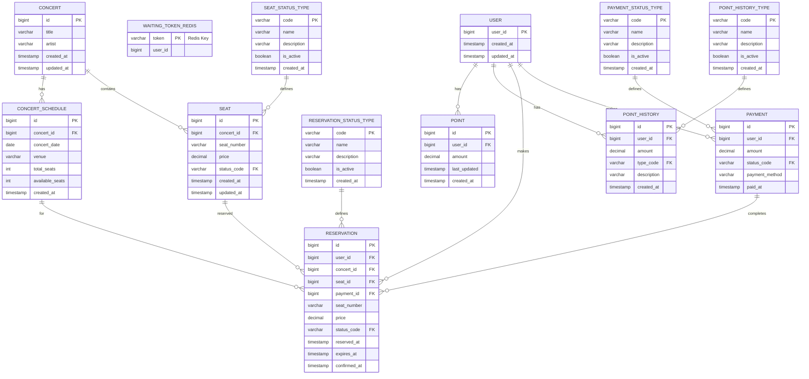

# 콘서트 예약 서비스

## 개요
대기열 시스템을 기반으로 한 콘서트 예약 서비스입니다. 다수의 사용자가 동시에 접근할 때 안정적인 서비스를 제공하며, 좌석 예약 시 동시성 문제를 해결합니다.

## 주요 기능
- **대기열 토큰 시스템**: 사용자 순서 관리 및 서비스 접근 제어
- **좌석 예약 시스템**: 임시 배정을 통한 안전한 좌석 예약
- **결제 시스템**: 사용자 잔액 관리 및 결제 처리
- **동시성 제어**: Redis 기반 분산 락으로 멀티 인스턴스 환경에서 안전한 데이터 처리


## API 엔드포인트

### 대기열 관리
- `POST /api/v1/queue/tokens` - 대기열 토큰 발급
- `GET /api/v1/queue/tokens/{token}/status` - 대기열 상태 조회

### 사용자 관리
- `POST /api/users?userId={userId}` - 사용자 생성

### 잔액 관리
- `POST /api/balance/charge` - 잔액 충전
- `GET /api/balance/{userId}` - 잔액 조회
- `GET /api/balance/history/{userId}` - 포인트 내역 조회

### 콘서트 관리
- `GET /api/concerts/available` - 예약 가능한 콘서트 목록 조회
- `GET /api/concerts/by-date?date={date}` - 특정 날짜 콘서트 조회
- `GET /api/concerts/{concertId}` - 콘서트 상세 정보 조회

### 좌석 관리
- `GET /api/concerts/{concertId}/seats/available` - 예약 가능한 좌석 목록 조회
- `GET /api/concerts/{concertId}/seats` - 모든 좌석 정보 조회
- `GET /api/concerts/seats/{seatId}` - 특정 좌석 정보 조회

### 예약 관리
- `POST /api/concerts/reservations` - 좌석 예약
- `GET /api/concerts/reservations/user/{userId}` - 사용자 예약 목록 조회
- `GET /api/concerts/reservations/{reservationId}` - 특정 예약 정보 조회

### 결제 관리
- `POST /api/payments` - 결제 처리
- `GET /api/payments/history/{userId}` - 결제 내역 조회
- `GET /api/payments/{paymentId}` - 특정 결제 정보 조회

## 시퀀스 다이어그램

### 1. 대기열 토큰 발급 및 상태 확인


### 2. 좌석 예약 프로세스


### 3. 결제 프로세스


## 클래스 다이어그램

### 핵심 서비스 클래스


## 데이터베이스 스키마 (ERD)


```
