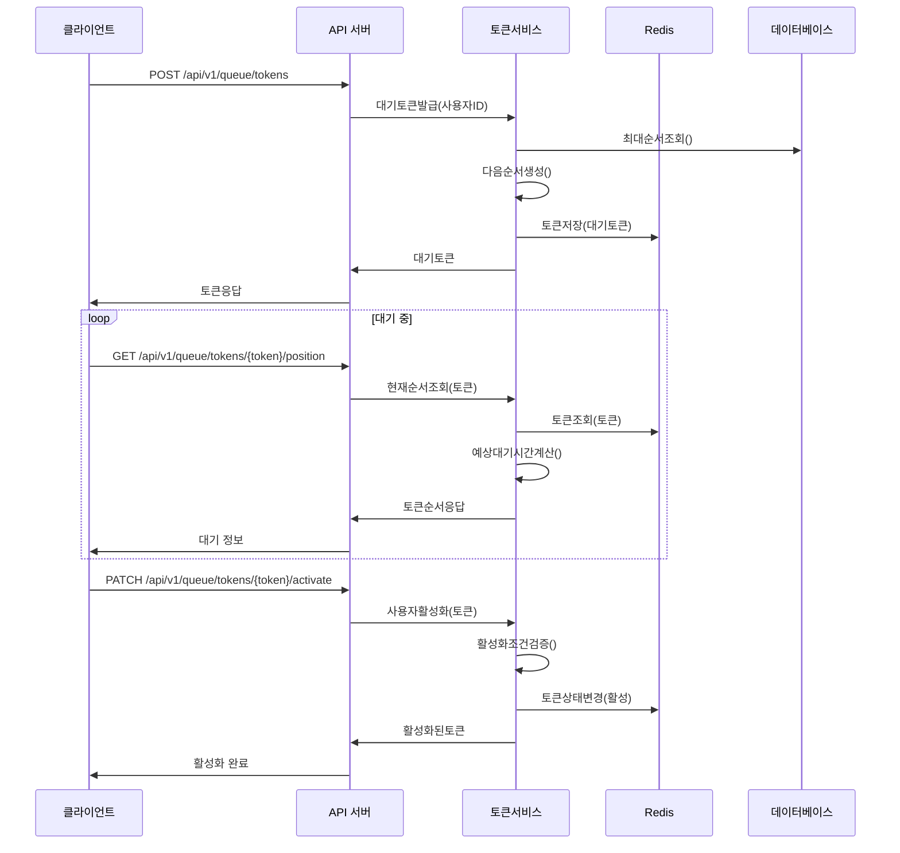
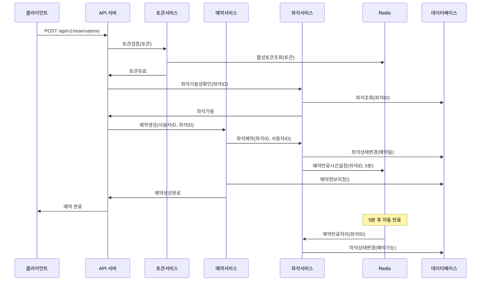
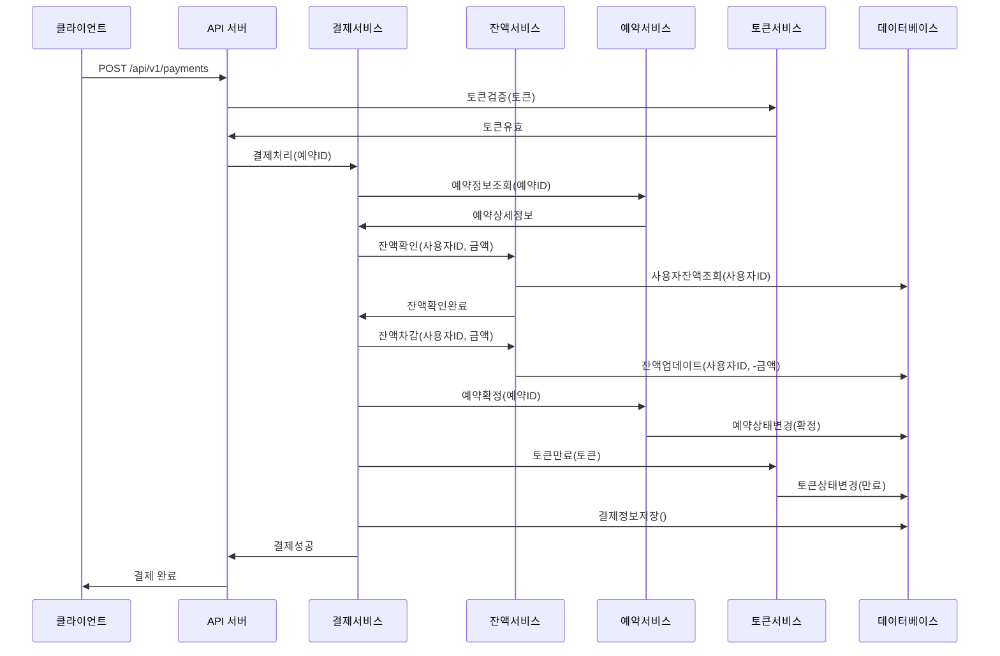
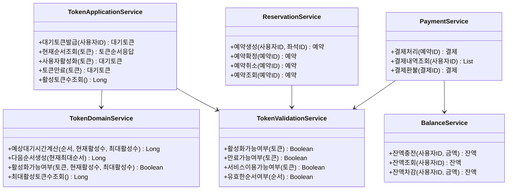
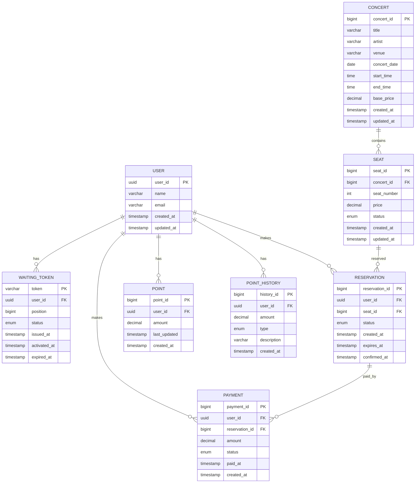

# 콘서트 예약 서비스

## 개요
대기열 시스템을 기반으로 한 콘서트 예약 서비스입니다. 다수의 사용자가 동시에 접근할 때 안정적인 서비스를 제공하며, 좌석 예약 시 동시성 문제를 해결합니다.

## 주요 기능
- **대기열 토큰 시스템**: 사용자 순서 관리 및 서비스 접근 제어
- **좌석 예약 시스템**: 임시 배정을 통한 안전한 좌석 예약 (1~50번 좌석)
- **결제 시스템**: 사용자 잔액 관리 및 결제 처리
- **동시성 제어**: 멀티 인스턴스 환경에서 안전한 데이터 처리

## 시퀀스 다이어그램

### 1. 대기열 토큰 발급 및 활성화

### 2. 좌석 예약 프로세스

### 3. 결제 프로세스

## 클래스 다이어그램

### 핵심 도메인 클래스

## 데이터베이스 스키마 (ERD)

