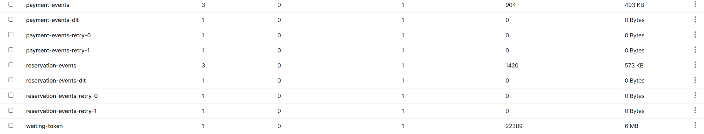
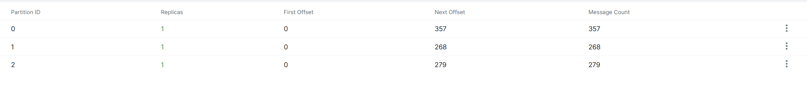
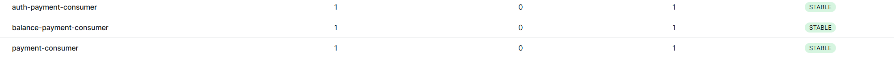
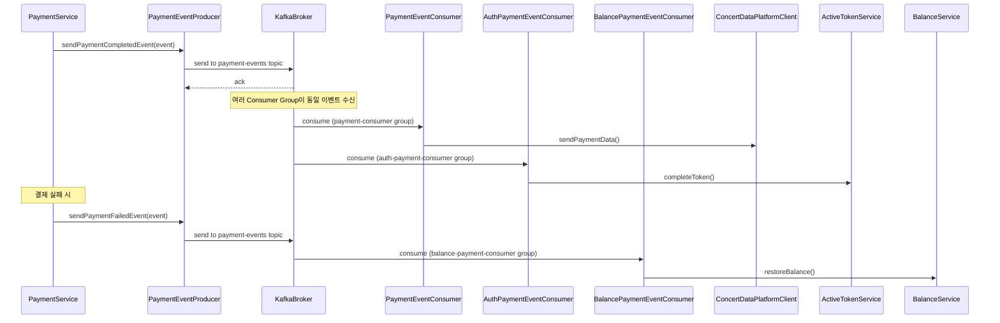
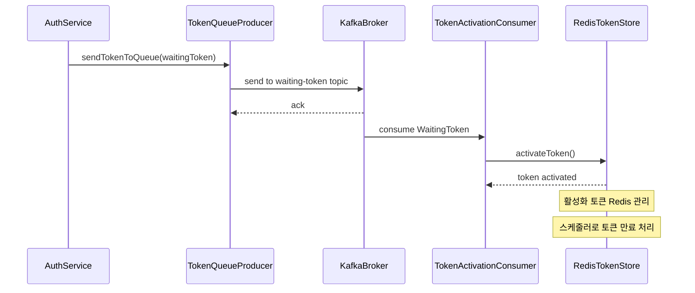
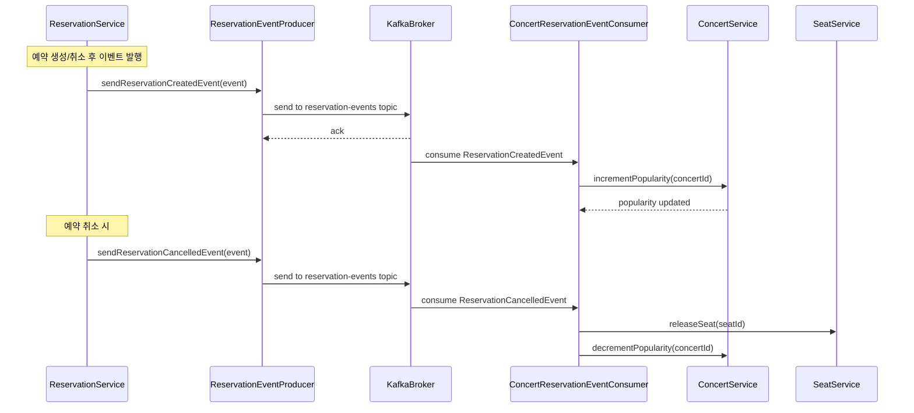

# STEP17 카프카 기초 개념 및 설계 문서

## 1. Apache Kafka 기초 개념

### 1.1 Kafka란?
Apache Kafka는 분산 스트리밍 플랫폼으로, 대용량의 실시간 데이터 스트림을 안정적으로 처리하기 위해 설계된 오픈소스 메시징 시스템입니다.

### 1.2 핵심 개념

#### 1.2.1 Producer (프로듀서)
- **역할**: 메시지를 Kafka 토픽으로 전송하는 애플리케이션
- **특징**: 
  - 메시지를 특정 토픽의 특정 파티션으로 전송
  - 키 기반 파티셔닝을 통해 메시지 순서 보장 가능
  - 배치 처리를 통한 성능 최적화

#### 1.2.2 Consumer (컨슈머)
- **역할**: Kafka 토픽에서 메시지를 읽어오는 애플리케이션
- **특징**:
  - Consumer Group을 통한 로드 밸런싱
  - Offset을 통한 메시지 처리 위치 추적
  - Auto-commit과 Manual-commit 옵션 제공

#### 1.2.3 Topic (토픽)
- **정의**: 메시지를 저장하는 논리적인 단위
- **특징**:
  - 여러 파티션으로 구성
  - 메시지의 카테고리나 분류 기준
  - 토픽별 독립적인 설정 가능

#### 1.2.4 Partition (파티션)
- **역할**: 토픽을 물리적으로 분할하는 단위
- **특징**:
  - 병렬 처리를 통한 처리량 향상
  - 파티션 내에서만 순서 보장
  - 각 파티션은 독립적인 로그 파일

#### 1.2.5 Offset (오프셋)
- **정의**: 파티션 내 메시지의 고유한 위치 식별자
- **특징**:
  - 파티션별로 독립적인 순차 번호
  - 컨슈머의 메시지 처리 위치 추적
  - 메시지 재처리 및 복구 가능

#### 1.2.6 Broker (브로커)
- **역할**: Kafka 클러스터를 구성하는 개별 서버
- **기능**:
  - 메시지 저장 및 전달
  - 토픽 파티션 관리
  - 클라이언트 요청 처리

### 1.3 Kafka의 주요 특징

#### 1.3.1 고성능
- **처리량**: 초당 수백만 메시지 처리 가능
- **지연시간**: 낮은 레이턴시로 실시간 처리
- **배치 처리**: 네트워크 효율성 최적화

#### 1.3.2 확장성
- **수평 확장**: 브로커 추가를 통한 용량 확장
- **파티션 확장**: 토픽 파티션 수 증가로 처리량 향상
- **동적 확장**: 무중단 클러스터 확장

#### 1.3.3 내구성
- **디스크 저장**: 메시지를 디스크에 영구 저장
- **복제**: 데이터 손실 방지를 위한 복제
- **장애 복구**: 자동 장애 감지 및 복구

#### 1.3.4 순서 보장
- **파티션 레벨**: 파티션 내 메시지 순서 보장
- **키 기반**: 동일 키를 가진 메시지의 순서 보장
- **전역 순서**: 단일 파티션을 통한 전역 순서 보장

### 1.4 Message Delivery Semantics

#### 1.4.1 At Most Once
- **특징**: 메시지 손실 가능, 중복 없음
- **용도**: 성능이 중요하고 일부 데이터 손실이 허용되는 경우

#### 1.4.2 At Least Once
- **특징**: 중복 가능, 메시지 손실 없음
- **용도**: 데이터 무결성이 중요한 경우 (기본 설정)

#### 1.4.3 Exactly Once
- **특징**: 중복 없음, 메시지 손실 없음
- **구현**: 트랜잭션과 Idempotent Producer 활용

## 2. 현재 프로젝트의 Kafka 구현 분석

### 2.1 토픽 구성

```kotlin
@Bean
fun waitingTokenTopic(): NewTopic {
    return NewTopic("waiting-token", 1, 1)
        .configs(mapOf(
            "retention.ms" to "86400000",        // 24시간 보관
            "cleanup.policy" to "delete"         // 시간 기반 삭제
        ))
}
```

**토픽별 설정:**
- **waiting-token**: 1개 파티션, 대기열 토큰 관리 (순서 보장 필요)
- **payment-events**: 3개 파티션, 결제 완료/실패 이벤트 처리 (병렬 처리)
- **reservation-events**: 3개 파티션, 예약 관련 이벤트 처리 (병렬 처리)

#### topic


#### partition


### 2.2 Producer 구현

```kotlin
@Component
class TokenQueueProducer(
    private val kafkaTemplate: KafkaTemplate<String, WaitingToken>
) {
    fun sendTokenToQueue(waitingToken: WaitingToken) {
        kafkaTemplate.send(WAITING_TOKEN_TOPIC, 0, waitingToken.token, waitingToken)
    }
}
```
- **TokenQueueProducer**: 단일 파티션(0)으로 순서 보장, 토큰 값을 키로 사용
- **PaymentEventProducer**: paymentId를 키로 사용하여 파티셔닝, Generic 타입으로 다양한 이벤트 처리

### 2.3 Consumer 구현

```kotlin
@RetryableTopic(
    attempts = "3",
    backoff = Backoff(delay = 1000, multiplier = 2.0)
)
@KafkaListener(
    topics = ["payment-events"],
    groupId = "payment-consumer"
)
fun handlePaymentEvent(@Payload event: Any) {
    when (event) {
        is PaymentCompletedEvent -> handlePaymentCompleted(event)
        is PaymentFailedEvent -> handlePaymentFailed(event)
    }
}
```
- **PaymentEventConsumer**: 3회 재시도, 지수 백오프, 런타임 타입 체크
- **기타 Consumer**: TokenActivationConsumer, BalanceConsumer, AuthConsumer 등



## 3. 비즈니스 시퀀스 다이어그램

### 3.1 결제 이벤트 처리 플로우



### 3.2 토큰 대기열 처리 플로우



### 3.3 예약 이벤트 처리 플로우


## 4. 토픽별 파티션 및 컨슈머 설정

### 4.1 토픽 구성 요약

| 토픽명 | 파티션 | 복제본 | 보관기간 | 용도 | 설계 근거 |
|--------|--------|--------|----------|------|-----------|
| waiting-token | 1 | 1 | 24시간 | 토큰 대기열 | 순서 보장 필요, 임시성 데이터 |
| payment-events | 3 | 1 | 7일 | 결제 이벤트 | 병렬처리, 감사 목적 |
| reservation-events | 3 | 1 | 7일 | 예약 이벤트 | 병렬처리, 통계 처리 |

### 4.2 Consumer Group 및 파티션 할당

#### 4.2.1 waiting-token 토픽
- **파티션**: 1개
- **Consumer Group**: `token-activation-consumer`
- **Consumer 인스턴스**: 1개 (파티션 수와 동일)
- **처리 방식**: 순차 처리로 토큰 순서 보장

#### 4.2.2 payment-events 토픽  
- **파티션**: 3개
- **Consumer Group**: `payment-consumer`
- **Consumer 인스턴스**: 최대 3개 (파티션별 1개)

#### 4.2.3 reservation-events 토픽
- **파티션**: 3개
- **Consumer Group**: `reservation-consumer`  
- **Consumer 인스턴스**: 최대 3개 (파티션별 1개)

