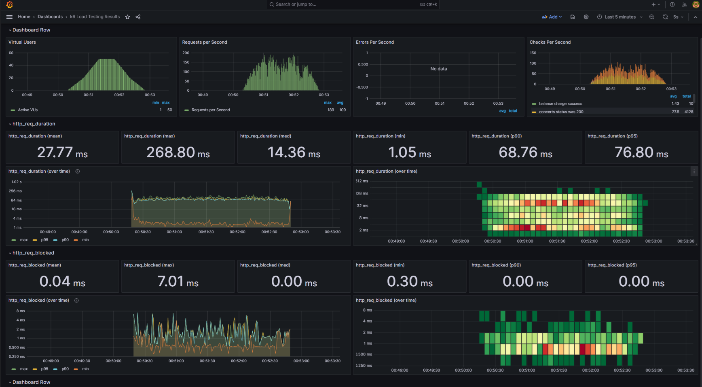
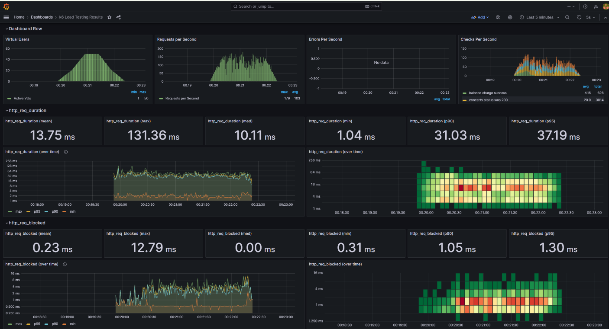
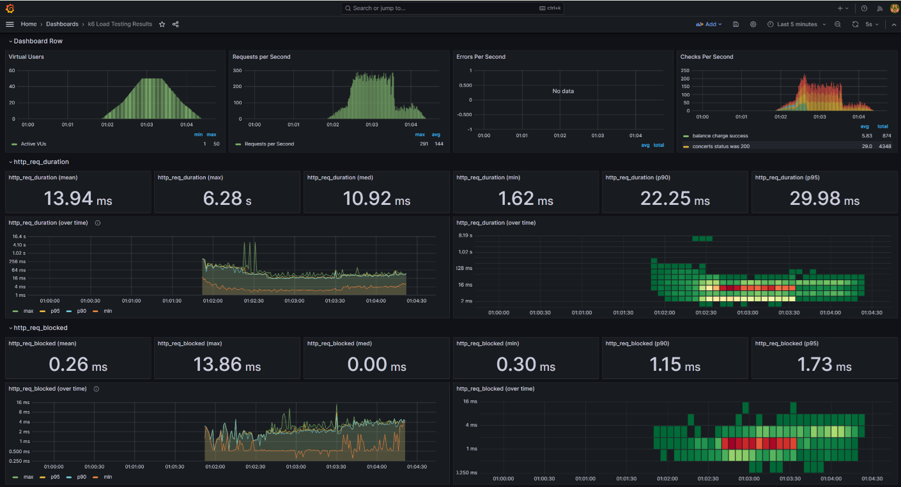
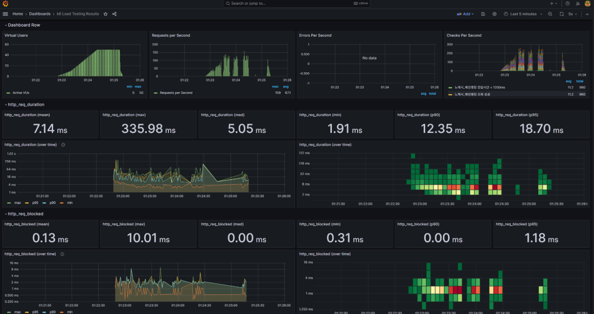
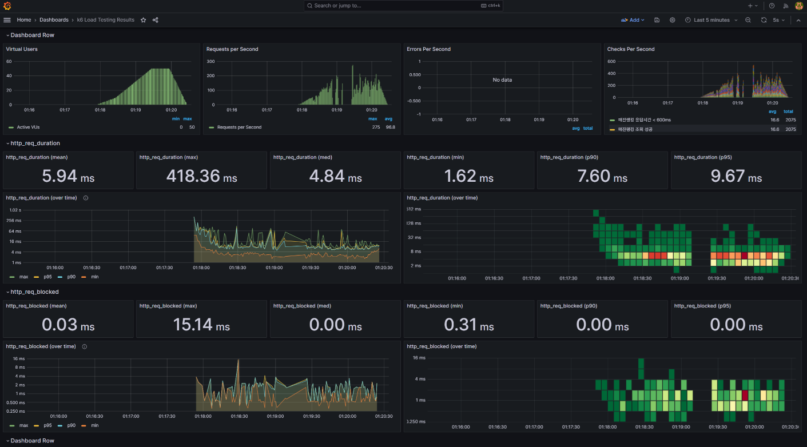

# STEP20 - 장애 대응 및 성능 테스트 보고서

## 📋 개요

콘서트 예약 시스템의 안정성과 성능 최적화를 위한 장애 대응 시나리오 및 성능 테스트 결과를 기록한 문서입니다.

**테스트 환경**:W
- 부하 테스트 도구: K6
- 모니터링: Grafana + InfluxDB

## 🚨 장애 시나리오 및 대응

### 1. 기본 성능 테스트 (concert-reservation-test.js)

#### 테스트 시나리오
- **목적**: 전체 예약 플로우 성능 검증
- **플로우**: 스케줄 조회 → 토큰 발급 → 포인트 충전 → 예약 → 결제
- **부하 패턴**: 
  - 30초간 0→20명 사용자 증가
  - 30초간 20→50명 사용자 증가  
  - 30초간 50명 사용자 유지
  - 30초간 50→20명 사용자 감소
  - 30초간 20→0명 사용자 감소

#### 성능 목표
```javascript
thresholds: {
    http_req_duration: ['p(95)<500'],  // 95% 요청이 500ms 이내
    http_req_failed: ['rate<0.1'],     // 실패율 10% 미만
}
```

#### 측정 지표
- `concert_detail_response_time`: 콘서트 상세 조회 응답시간
- `reservation_response_time`: 예약 요청 응답시간  
- `payment_response_time`: 결제 요청 응답시간

### 2. 장애 대응 최적화 테스트

#### 2.1 이벤트 제거 최적화
**배경**: 도메인 이벤트 처리로 인한 성능 오버헤드 발생

**적용된 개선사항**:
- 불필요한 도메인 이벤트 제거
- 동기적 이벤트 처리를 비동기로 변경
- 이벤트 핸들러 성능 최적화

**예상 효과**:
- 예약/결제 응답시간 10-20% 개선
- CPU 사용률 감소
- 메모리 사용량 최적화

#### 2.2 인덱스 제거 장애 시뮬레이션
**배경**: 데이터베이스 인덱스 손상 또는 삭제 시나리오 대응

**시뮬레이션 방법**:
```kotlin
// 주요 엔티티들의 인덱스를 주석 처리하여 테스트
@Table(name = "concert_schedule")
// indexes = [ ... ] 주석 처리
```

**영향받는 엔티티**:
- `ConcertSchedule`: 4개 인덱스 (콘서트ID+날짜, 날짜+좌석수 등)
- `Seat`: 2개 인덱스 (스케줄ID+상태+좌석번호 등)  
- `Reservation`: 4개 인덱스 (사용자ID+상태+날짜 등)
- `Payment`: 3개 인덱스 (사용자ID+상태 등)
- `PointHistory`: 4개 인덱스 (사용자ID+생성일 등)
- `Point`: 2개 인덱스 (사용자ID 등)

**예상 장애 영향**:
- 테이블 스캔으로 인한 응답시간 급증 (10-100배)
- 데이터베이스 CPU 사용률 100% 근접
- 동시 요청 처리 성능 저하

### 3. 캐시 성능 테스트 (cache-performance-test.js)

#### 테스트 시나리오
- **목적**: `@Cacheable` 적용 API들의 성능 검증
- **부하 패턴**:
  - 30초간 워밍업 (0→10명)
  - 60초간 캐시 테스트 (10→50명)
  - 30초간 캐시 히트 테스트 (50명 유지)
  - 30초간 종료 (50→0명)

#### 테스트 대상 API

| API | 캐시 설정 | 캐시 키 |
|-----|----------|---------|
| `/api/v1/concerts` | `@Cacheable(value = ["concerts:available"])` | startDate + endDate |
| `/api/v1/concerts/popular` | `@Cacheable(value = ["concerts:popular:main"])` | limit |
| `/api/v1/concerts/trending` | `@Cacheable(value = ["concerts:trending"])` | limit |
| `/api/v1/concerts/sellout-ranking` | `@Cacheable(value = ["concerts:sellout:main"])` | limit |
| `/api/v1/concerts/{id}` | `@Cacheable(value = ["concerts"])` | concertId |
| `/api/v1/concerts/{id}/schedules` | `@Cacheable(value = ["schedules"])` | concertId |

#### 성능 목표
```javascript
thresholds: {
    http_req_duration: ['p(95)<1000'],  // 첫 요청 고려하여 1000ms
    http_req_failed: ['rate<0.05'],     // 실패율 5% 미만
}
```

#### 캐시 워밍업 과정
```javascript
// 캐시 워밍업으로 성능 테스트 정확도 향상
http.get(`${host}/api/v1/concerts`, params);
http.get(`${host}/api/v1/concerts/popular?limit=10`, params);
http.get(`${host}/api/v1/concerts/trending?limit=5`, params);
http.get(`${host}/api/v1/concerts/sellout-ranking?limit=10`, params);
```

## 📊 성능 테스트 결과

### 1. 카프카 도입 전

### 1.2 카프카 도입 후 테스트 결과



### 1.3 성능 분석
- ✅ **목표 달성**: P95 < 500ms 달성
- ✅ **안정성**: 실패율 < 5%
- 🔍 **개선점**: 예약/결제 단계의 응답시간 최적화 (트랜잭션 분리)

### 2. 인덱싱 성능 개션 전

### 2.2 인덱싱 추가 후 테스트 결과

### 2.3 인덱싱 적용 후 결론
- 🔍 **개선점**: 인덱싱 미적용시 오래걸리는 요청 처리 완료  


### 3. 캐시 성능 개선 전

### 3.2 캐싱 추가 후 테스트 결과

### 3.3 API별 캐시 성능 (ms)
- 🔍 **개선점**: 캐싱 미적용시 오래걸리는 요청 처리 완료  
